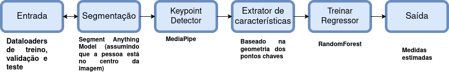

# Desafio_INOVAI_2025

---

---

## 🏃‍♂️ Planejamento do Sprint: 09 até 23 de setembro

### **Bloco de Tarefa 0: 09 até 11 de setembro** – *Entendimento do problema e planejamento das tarefas*
- [x] Buscar melhorias no notebook dos colaboradores **-> Eu e colaboradores**  
- [x] Entender o problema **-> Eu e colaboradores** 
- [x] Definir experimentos, métricas de avaliação e outros Blocos de Tarefas **-> Eu** 

---

### **Bloco de Tarefa 1: 11 até 13 de setembro** – *Configuração inicial e definição da baseline*
- [ ] Criar notebook para preparação dos dados **-> Colaborador B** 
- [ ] Organizar a estrutura inicial do notebook **-> Eu e Colaborador B** 
- [ ] Implementar código de avaliação da métrica alvo **-> Eu e Colaborador B**
- [ ] Melhorar a qualidade das máscaras de segmentação geradas na fase Segmentação do fluxo **-> Eu e Colaborador A**
- [ ] Documentar os resultados dos experimentos da baseline  **-> Colaborador B**

---

### **Bloco de Tarefa 2: 14 até 16 de setembro** – *Desenvolvimento do Regressor no fluxo de execução proposto*
- [ ] Desenvolver código para treinar, validar e testar o regressor de estimação de medidas (alvo) **-> Eu** 
- [ ] Escrever testes unitários para o módulo do regressor **-> Colaborador A** 
- [ ] Documentar os resultados experimentais **-> Colaborador B** 

---

### **Bloco de Tarefa 3: 19 até 20 de setembro** – *Continuar refinamento do fluxo de execução*
- [ ] Melhorar o módulo de detecção de keypoints **-> Eu e Colaborador A** 
- [ ] Avaliar e discutir o desempenho de todo o pipeline **-> Eu e colaboradores** 
- [ ] Documentar os resultados da avaliação do pipeline **-> Colaborador B** 

---

### **Bloco de Tarefa 4: 21 até 23 de setembro** – *Preparar finalização*
- [ ] Revisar todos os componentes e documentações **-> Eu e Colaborador A** 
- [ ] Preparar apresentação final **-> Eu e Colaborador B** 

---
